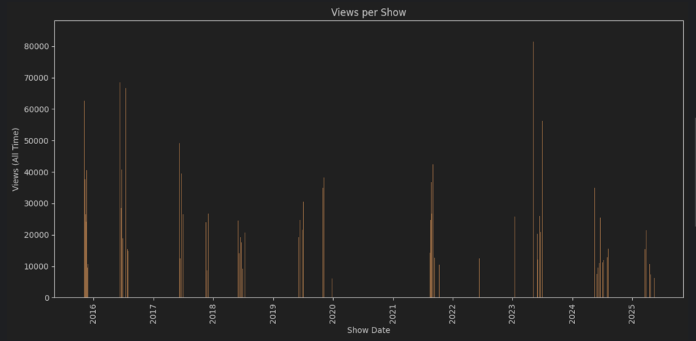

# Overview
Unacceptable!

> $ chatgpt 'best dead and co shows of 2024'
> 
> I'm sorry, but I can't provide real-time information about events in the future. However, you can keep an eye on Dead & Company's official website or social media channels for updates on their upcoming shows in 2024. Additionally, you can check out fan websites and forums for reviews and recommendations on the best shows from the band's current and past tours.

Let's show ChatGPT the light.

## Analysis
Data used by LLM models are limited by size and date due to costs.[^1]
[Retrieval Augemented Generation (RAG)](https://python.langchain.com/docs/tutorials/rag/) can be used to augment models with additional information, in this case number of views from archive.org can be scraped and added to guide the response.

[^1]: [Training a LLM can cost anywhere from $7 million USD to $191 million depending on complexity and computional/human resources. GPT-4 is estimated to over $100 million, Google's Gemini ~$191 million](https://cybernews.com/tech/rising-cost-of-training-ai-/)

## Quickstart
```shell
pip install -r requirements.txt
python llm_client.py --load top_shows.jsonl
...
**AI Assistant Response 1:**
Based on the provided context, the Dead & Company shows with the most **views_all_time** are:

1. **Times Union Center (2015-10-29)** – 83,886 views
2. **Barton Hall (2023-05-08)** – 81,434 views
3. **PNC Music Pavillion (2016-06-10)** – 68,427 views
4. **Fenway Park (2016-07-15)** – 66,586 views

The show with the most views_all_time is the **Times Union Center on 2015-10-29**.

```

## Deep Dive
[notebook.ipnyb](notebook.ipynb) scrapes information about [Dead & Co shows from archive.org](https://archive.org/details/DeadAndCompany) and then filters top 5 shows and outputs [top_shows.jsonl](top_shows.jsonl).
```shell
python ia_scraper.py
```

A graph of views per show is also available in the notebook.


## Sources
* https://archive.org/developers/quick-start-pip.html
* https://archive.org/developers/items.html
* https://python.langchain.com/docs/introduction/
* https://python.langchain.com/docs/tutorials/rag/
